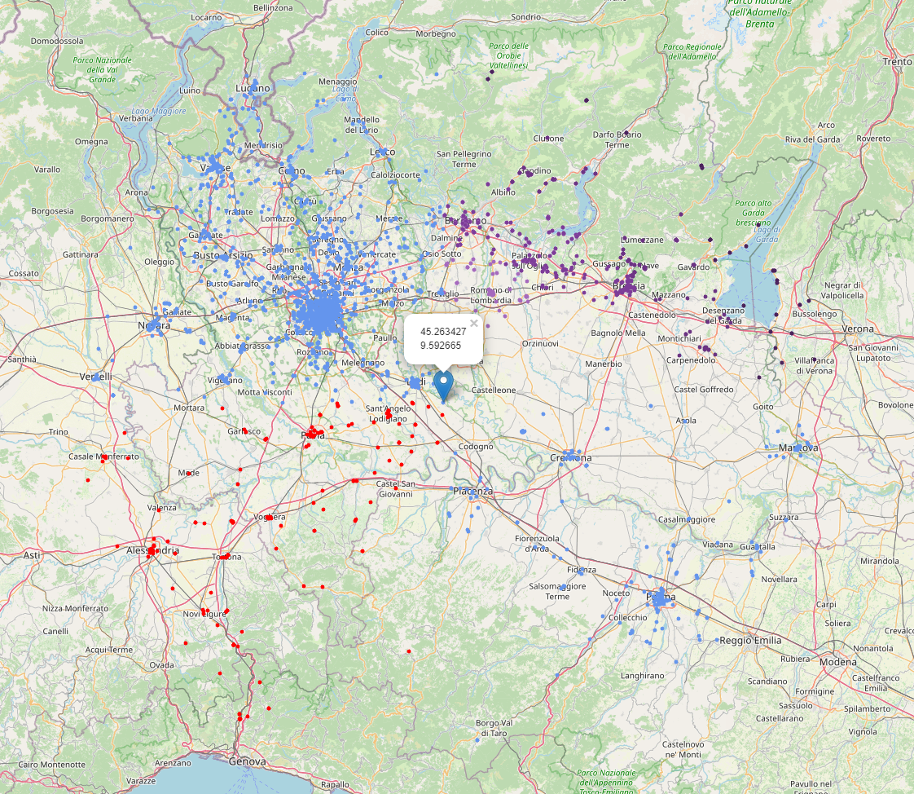

# GOGPY
GPS of GPS 데이터 전처리 프로세스

## TODO
1. Pilot Process Design (~2022.09.13)
    - USA California [41.992350, -124.702269], [32.741297, -113.979613] 데이터 수집
    - H3 인덱싱 프로세스 구현
2. 총 3억개 데이터 다운로드. (~2022.09.21)
3. DB 구조 설계.
    - MariaDB 활용. H3 코드가 Table 명으로.
    - 이미 처리된 Place_flag만 제거하고, 나머지 데이터는 원본 그대로를 유지.
4. 사용자가 지정한 GPS 반경 n km 위치를 수집.
    - 백만 건 정도의 데이터를 샘플로, 랜덤한 좌표를 선정.
    - 해당 좌표를 H3 코드로 변환하고, k_ring 개념을 이용하여, 주변 H3 코드를 확보.
    - 현재까지 확보한 H3와 동일한 파일명을 가진 데이터 중 n km 내의 좌표를 획득.
    - find_gps로 프로세스는 구현 완료. (~2022.09.25)
    - 프로세스 실행 시간은 0.2~0.4초 정도로 측정됨.

## Maps created with folium (example)
  
